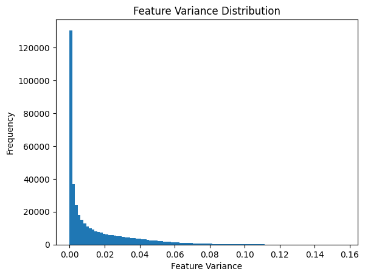
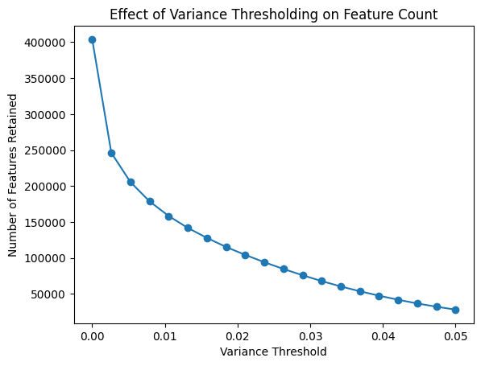

# Variance Thresholding for Feature Selection

## Overview
Variance thresholding was applied to reduce dimensionality in a **high-dimensional dataset (p >> n)** scenario, where the original dataset contained **403,955 features and 578 samples**.

## Feature Variance Distribution
The variance distribution of features is heavily skewed, with most features having **very low variance**, indicating they contribute little to classification.

*Figure 1: Feature Variance Distribution*

## Effect of Variance Thresholding
Applying different variance thresholds significantly reduces the number of retained features. At **threshold = 0.01**, the dataset was reduced to **162,060 features**, improving computational efficiency while retaining informative features.

*Figure 2: Effect of Variance Thresholding on Feature Count*

## Conclusion
Increasing the variance threshold effectively removes low-variance, uninformative features. A threshold between **0.01 and 0.03** may be optimal for balancing feature reduction and retaining useful information. Further refinement using **L1 regularization or feature importance methods** is recommended.
